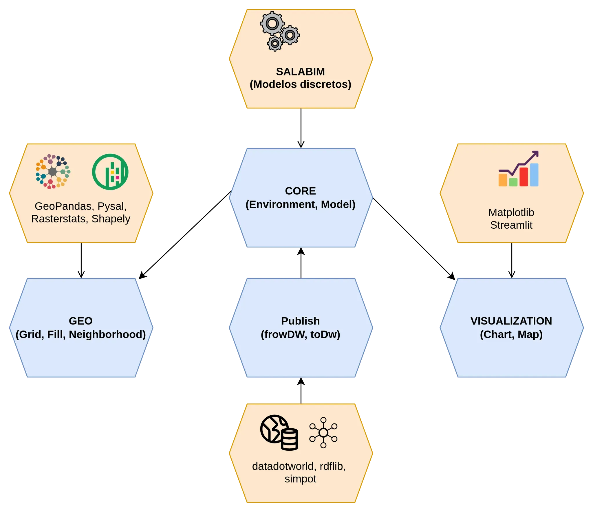

# DisSModel

Biblioteca para modelagem baseada em agentes e autômatos celulares com suporte espacial.

### Visão Geral da Ferramenta

A ferramenta que aqui se apresenta foi concebida para a construção e análise de modelos discretos, com ênfase na simulação de sistemas dinâmicos espaciais. Inspirada na biblioteca **Terrame**, a proposta é proporcionar um ambiente flexível e integrado ao ecossistema **Python**, utilizando um conjunto de bibliotecas amplamente reconhecidas no mercado para facilitar tanto a modelagem quanto a visualização de dados espaciais.

Embora a Terrame seja focada na simulação discreta e no controle de eventos discretos no domínio territorial, a versão Python propõe uma série de módulos especializados para integrar funcionalidades geoespaciais, controle de eventos e visualização de maneira mais modular e extensível.

### Objetivos

- **Modelagem Discreta**: A ferramenta permite a criação de modelos discretos, utilizando a biblioteca **Salabim** para controle de eventos discretos.
- **Integração Espacial**: Oferece uma camada robusta de suporte à análise espacial por meio do uso de bibliotecas como **GeoPandas**, **PySAL**, **Shapely** e **RasterStats**, que permitem o tratamento e análise de dados geoespaciais.
- **Visualização Interativa**: Com o auxílio de **Matplotlib** e **Streamlit**, proporciona visualizações ricas e interativas dos modelos gerados, auxiliando na análise e na interpretação dos dados de maneira intuitiva.
- **Publicação e Integração**: Inclui uma integração com o **DataWorld**, permitindo que os modelos e resultados possam ser facilmente compartilhados, documentados e publicados.

Esta ferramenta foi criada com o intuito de oferecer aos pesquisadores, analistas e engenheiros uma plataforma eficiente e adaptável para realizar experimentos e gerar resultados significativos em modelos discretos e análises espaciais.

### Estrutura da Documentação

A documentação está estruturada em quatro módulos principais, cada um com seu foco específico. A seguir, apresentamos os principais módulos que compõem a ferramenta:

1. **Módulo Core (Salabim)**: O módulo central da ferramenta, responsável pelo controle de eventos discretos e pela simulação do comportamento do modelo. Este módulo utiliza a biblioteca **Salabim**, que oferece funcionalidades robustas para a modelagem de processos discretos e controle de eventos no tempo.
2. **Módulo Geo (GeoPandas, PySAL, Shapely, RasterStats)**: Este módulo oferece a infraestrutura necessária para trabalhar com dados geoespaciais. Com o uso de **GeoPandas**, é possível carregar, manipular e analisar dados geográficos em diversos formatos. Além disso, **PySAL** e **Shapely** permitem a análise espacial e a geração de vizinhanças, enquanto **RasterStats** possibilita a análise de dados rasterizados.
3. **Módulo Visualization (Matplotlib, Streamlit)**: O módulo de visualização é projetado para criar gráficos e interfaces interativas. Usando **Matplotlib**, é possível gerar gráficos estáticos detalhados, enquanto **Streamlit** facilita a criação de interfaces interativas, permitindo ao usuário visualizar e manipular os resultados de maneira dinâmica e em tempo real.
4. **Módulo Publish (DataWorld)**: O módulo de publicação integra a ferramenta ao **DataWorld**, um ambiente colaborativo para visualização e compartilhamento de dados. Esta funcionalidade facilita a publicação de resultados, permitindo que o modelo e seus dados possam ser compartilhados e acessados por outros usuários de forma simples e eficiente.

