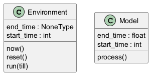

# Diagrama de Classes do Pacote Core

Este diagrama exibe as classes principais do pacote `core`, que formam a base para as simulações no projeto `dissmodel`.

## Descrição

O pacote `core` contém duas classes fundamentais:

- **Environment**: Herda de `salabim.Environment` e gerencia o ambiente de simulação, suportando `start_time` e `end_time` personalizados.
- **Model**: Herda de `salabim.Component` e define o comportamento base para todos os modelos do sistema, incluindo métodos como `execute()` e suporte à plotagem via `track_plot`.

## Relações

- `Environment` é usado por `Model` para gerenciar o tempo e o contexto da simulação.
- Dependências externas com `salabim` são exibidas, mostrando a herança de `Environment` e `Model`.
- Associações com `visualization.track_plot` indicam integração com o módulo de visualização.