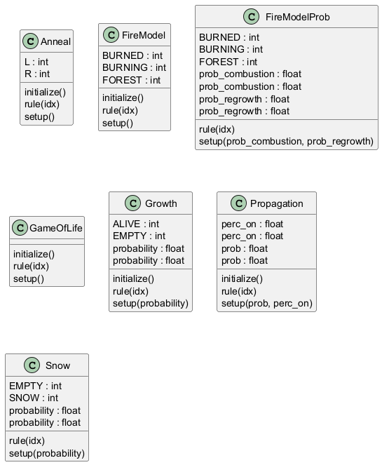

# Diagrama de Classes do Subpacote Models/CA

Este diagrama apresenta as classes do subpacote `models/ca`, que implementam modelos de autômatos celulares.

## Descrição

O subpacote `models/ca` contém classes que herdam de `geo.CellularAutomaton`:

- **Snow**: Simula a queda e acumulação de neve.
- **Propagation**: Modela a propagação de estados em uma grade.
- **GameOfLife**: Implementa o clássico autômato celular de Conway.
- **FireModel**: Simula a propagação de incêndios florestais.
- **Anneal**: Modela um sistema de recozimento (annealing).

## Relações

- Todas as classes herdam de `geo.CellularAutomaton`, que por sua vez herda de `core.Model`.
- Possuem dependências com `geo.fill.FillStrategy` e `libpysal.weights` (ex.: `Queen`, `Rook`, `KNN`) para definição de vizinhanças e inicialização de estados.
- Integram-se com o pacote `visualization` para exibição de resultados espaciais.