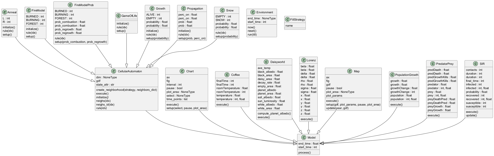
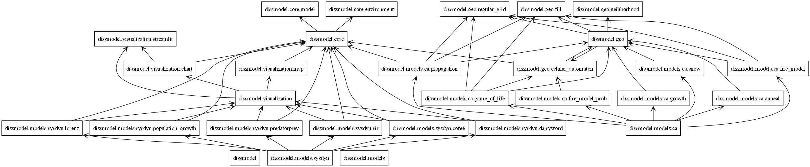
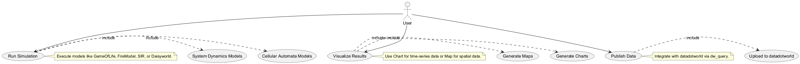

# Visão Geral do Sistema

Esta seção apresenta uma visão geral da arquitetura do projeto `dissmodel`, começando com o diagrama de classes, que detalha todas as classes do projeto e suas relações, seguido pelo diagrama de pacotes, que destaca as dependências entre os módulos do sistema.

## Diagrama de Classes

O diagrama abaixo, gerado com `pyreverse`, mostra todas as classes do projeto `dissmodel` e suas relações, incluindo herança e associações entre os módulos `core`, `geo`, `models/ca`, `models/sysdyn`, `visualization` e `publish`.

## Diagrama de Pacotes

O diagrama abaixo ilustra a organização dos módulos do projeto e suas interdependências.

## Diagrama de Casos de Uso

O diagrama abaixo mostra os principais casos de uso do sistema, incluindo execução de simulações, visualização de resultados e publicação de dados.

## Diagrama de Atividades

O diagrama abaixo descreve o fluxo de execução de uma simulação com `CellularAutomaton`.

## Descrição

O projeto `dissmodel` é organizado em módulos que estruturam as funcionalidades de simulação, visualização e publicação de dados. Abaixo está uma descrição detalhada dos módulos e suas interdependências, conforme ilustrado nos diagramas:

- **core**: Contém as classes base `Environment` e `Model`, que herdam de `salabim.Environment` e `salabim.Component`, respectivamente, fornecendo a base para todas as simulações.
- **geo**: Gerencia a geração e manipulação de espaços geográficos, com a classe `CellularAutomaton` e funções utilitárias como `fill`, `neighborhood` e `regular_grid`.
- **models**: Dividido em dois subpacotes:
  - **ca**: Inclui modelos de autômatos celulares, como `GameOfLife`, `FireModel`, `Snow`, `Propagation` e `Anneal`, que herdam de `geo.CellularAutomaton`.
  - **sysdyn**: Inclui modelos de dinâmica de sistemas, como `SIR`, `Daisyworld`, `PredatorPrey`, `PopulationGrowth`, `Lorenz` e `Coffee`, que herdam de `core.Model`.
- **visualization**: Responsável pela visualização de resultados, com classes como `Chart` e `Map`, que herdam de `core.Model` e utilizam bibliotecas como `matplotlib`.
- **publish**: Gerencia a integração com `datadotworld` para publicação de dados, utilizando a função `dw_query`.

As setas nos diagramas indicam dependências, como `models/ca` dependendo de `geo` e `core`, `visualization` dependendo de `core` e bibliotecas externas (e.g., `matplotlib`), e `publish` dependendo de `datadotworld` e `geopandas`.

O diagrama de classes detalha as relações entre classes, como a herança de `CellularAutomaton` e modelos específicos (`GameOfLife`, `SIR`, etc.) de `Model`, além de associações com utilitários como `geo.fill.FillStrategy` e `libpysal.weights`.