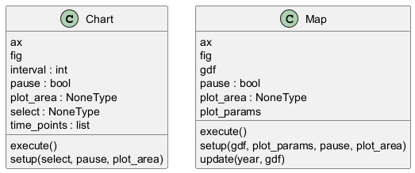

# Diagrama de Classes do Pacote Visualization

Este diagrama mostra as classes do pacote `visualization`, responsáveis pela exibição de resultados das simulações.

## Descrição

O pacote `visualization` contém:

- **Chart**: Gera gráficos de linha para variáveis rastreadas (ex.: população em `SIR`).
- **Map**: Exibe mapas espaciais baseados em `GeoDataFrame` (ex.: estados de células em `GameOfLife`).
- Função utilitária `display_inputs`: Cria interfaces interativas no Streamlit.

## Relações

- `Chart` e `Map` herdam de `core.Model`.
- Possuem dependências com `matplotlib.pyplot`, `streamlit` e `IPython.display` para renderização em diferentes ambientes (CLI, Jupyter, Streamlit).
- Integram-se com `core.Environment` e `geo.CellularAutomaton` para acessar dados de simulação.